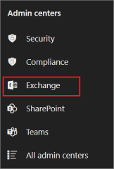

# Exchange admin center in Exchange Online

The Exchange admin center (EAC) is the web-based management console in Exchange Online that's optimized for on-premises, online, and hybrid Exchange deployments. It replaces 
the Exchange Control Panel (ECP) to manage email settings for your organization.

## Get to the new Exchange admin center 

You must have [Microsoft 365 admin permissions](/microsoft-365/admin/add-users/assign-admin-roles) to access the new Exchange admin center. For more information, see [Permissions in Exchange Online](permissions-exo/permissions-exo.md).

1. [Sign in](https://support.microsoft.com/office/e9eb7d51-5430-4929-91ab-6157c5a050b4) to Microsoft 365 or Office 365 using your work or school account.

2. In the left navigation pane, navigate to **Admin centers** > **Exchange**.

    

You can also get to the new Exchange admin center directly by using the URL [https://admin.exchange.microsoft.com](https://admin.exchange.microsoft.com) and signing in using your credentials.

>[!NOTE]
> Be sure to use a private browsing session (not a regular session) to access the Exchange admin center using the direct URL. This will prevent the credential that you are currently logged on with from being used. To open an InPrivate Browsing session in Microsoft Edge or an incognito window in Google Chrome, press CTRL+SHIFT+N. To open an InPrivate Browsing session in Microsoft Edge Legacy, Internet Explorer, or a Private Browsing session in Mozilla Firefox, press CTRL+SHIFT+P.

## For more information on new EAC and Classic EAC

- To explore features in new EAC, see [New Exchange admin center](features-in-new-eac.md)

- To explore features in Classic EAC, see [Classic Exchange admin center](features-in-classic-eac.md)

- To understand the differences between Classic and new EAC, see [Classic and New Exchange admin center differences](https://docs.microsoft.com/exchange/changes-in-exchange-admin-center).

- To get an update on the journey of the new EAC, see [What's new in Exchange admin center](https://docs.microsoft.com/exchange/whats-new).

## Supported browsers

See the following articles:

- [Microsoft 365 and Office resources](https://www.microsoft.com/microsoft-365/microsoft-365-and-office-resources): lists supported browsers for Microsoft 365, Office 365, and the Exchange admin center.

- [Supported Browsers for Outlook on the web](https://support.microsoft.com/office/c89774d6-0722-4c93-a547-ef45e693e006).

## Related articles

Are you using Exchange Server? See [Exchange admin center in Exchange Server](../ExchangeServer/architecture/client-access/exchange-admin-center.md).

Are you using Exchange Online Protection? See [Exchange admin center in Exchange Online Protection](/microsoft-365/security/office-365-security/exchange-admin-center-in-exchange-online-protection-eop).
