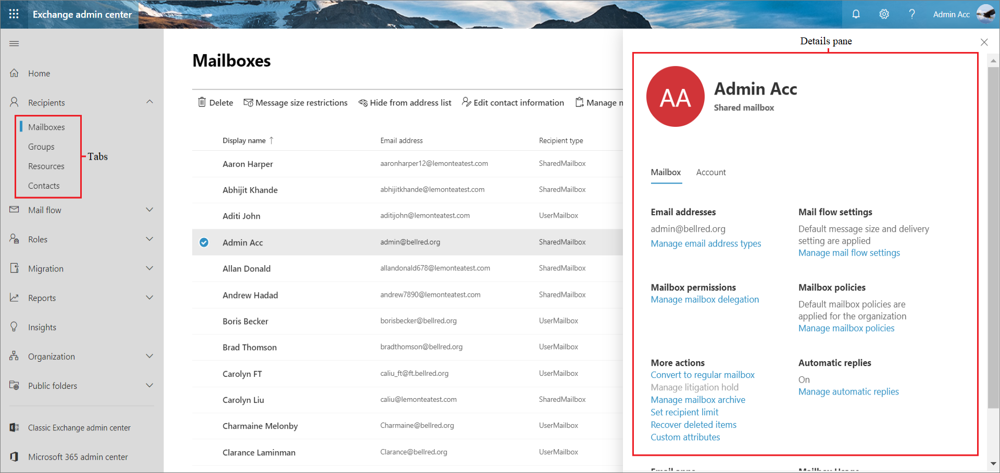

# New Exchange admin center 

Here's what the new Exchange admin center looks like.

## Home page

You can personalize your home page by selecting a theme, setting your language, and timezone from the **Settings** bubble.

1. To personalize your dashboard, click **+ Add card** on top of the homepage and drag any card onto the dashboard to the location you want.

2. To learn about the new updates in the new Exchange admin center, click **What's New?**.

3. To sign out of the new Exchange admin center and sign in as a different user, click **My account tile**. You can also sign in with another account.

4. To learn about the new Exchange admin center, in **Training & guide**, select **Training for admins** for a video tutorial and **Documentation**.

5. To get help from Microsoft 365 Support assistant, click .

6. To give feedback to help improve the new Exchange admin center, click . While it's not necessary to provide your email ID, you can click **You can contact me about this feedback** checkbox and provide your email ID to help the team to resolve your concerns faster.

### Feature pane

Here are the features available in the left-hand navigation.

|**Area**|**What you do here**|
|:-----|:-----|
|**Recipients**|View and manage your mailboxes (both user and shared mailboxes), groups, resource mailboxes, and contacts.|
|**Mail flow**|Trace messages, create rules, manage remote domains and accepted domains, add connectors, manage alert, and alert policies.|
|**Roles**|Manage administrator roles.|
|**Migration**|Migrate mailboxes in batches.|
|**Reports**|View reports on mail flow and migration batches.|
|**Insights**|Use the recommendations to discover trends and/or insights, and take actions to fix issues related to mailbox and mail flow.|
|**Organization**|Manage organization sharing and apps for Outlook.|
|**Public folders**|Manage public folders and public folder mailboxes.|

> [!NOTE]
> You can also access **Classic Exchange admin center** and **Microsoft 365 admin center**, by selecting them at the bottom of left navigation panel.

### Tabs

The tabs are your second level of navigation. Each of the feature areas contains various tabs, each representing a complete feature.

### Toolbar

When you click most tabs, you'll see a toolbar. The toolbar has icons that perform a specific action.

### List view

When you select a tab, in most cases you'll see a list view. The list view in the new Exchange admin center is designed to remove limitations that existed in the Classic Exchange admin center and Exchange Control Panel.

### Details pane

When you select an item from the list view, information about that object is displayed in the details pane.

 **To bulk edit several items**: Select the objects you want to bulk edit, and use the options in the toolbar.
 
## Related articles

[Exchange Online](https://docs.microsoft.com/exchange/exchange-online)

[Exchange admin center in Exchange Online](https://docs.microsoft.com/exchange/exchange-admin-center)

[What's new in Exchange admin center](https://docs.microsoft.com/exchange/whats-new)
