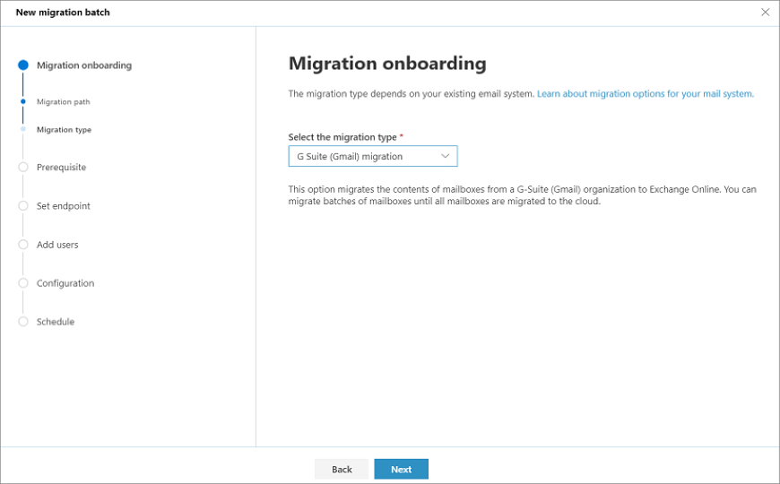

# Perform automated Google Workspace migration through new Exchange Admin Center

With the new Exchange Admin Center (EAC), the migration of mails, contacts, and calendar from Google Workspace to Microsoft 365 or Office 365 has been automated. The process has been now simplified to the extent that several of the manual steps that a user had to perform manually are no longer required.

> [!NOTE]
> The new EAC continues to offer manual migration of Google Workspace to Microsoft 365 or Office 365.

## Start a Google Workspace migration batch with the new Exchange admin center (New EAC)

> [!IMPORTANT]
> Microsoft's data migration tool is currently unaware of tools enforcing messaging records management (MRM) or archival policies. Because of this, any messages that are deleted or moved to archive by these policies will result in the migration process flagging these items as "missing". The result is perceived data loss rather than actual data loss, which makes it much harder to identify actual data loss during any content verification checks. <br/><br/>Therefore, Microsoft strongly recommends disabling all MRM and archival policies before attempting any data migration to mailboxes.

1. In the new [Exchange Admin center](https://admin.exchange.microsoft.com/#/), navigate to **Migration** > **Batch**.

2. Click **New Migration batch** and follow the instructions in the details pane.

3. Under **Migration Onboarding**:
    1. Enter the batch name, select the mailbox migration path and click **Next**.
    1. From the **Select the migration type** drop-down list, select **G Suite (Gmail) migration** and click **Next**.
   
    3. In **Prerequisites** section, manually configure G-Suite for migration.
    1. In **Set endpoint** section, select the migration endpoint from the drop-down list and click **Next**.
    

    > [!NOTE]
    > To migrate Gmail mailboxes successfully, Microsoft 365 or Office 365 needs to connect and communicate with Gmail. To do this, Microsoft 365 or Office 365 uses a migration endpoint. Migration endpoint is a technical term that describes the settings that are used to create the connection so you can migrate the mailboxes.

4. Create a CSV file containing the set of all of the users you want to migrate. You will need its filename below. The allowed headers are:

    - EmailAddress (required). Contains the primary email address for an existing Microsoft 365 or Office 365 mailbox.

    - Username (optional). Contains the Gmail primary email address, if it differs from EmailAddress.

      ```CSV
      EmailAddress
      will@fabrikaminc.net
      user123@fabrikaminc.net
      ```

5. In **Add user mailboxes** section, import the CSV file and click **Next**.

6. In **Move configuration** section, enter the details and click **Next**.

7. In **Schedule batch migration** section, verify all the details, click **Save**, and then click **Done**.

    

    Once the batch status changes from **Syncing** to **Synced**, you need to complete the batch.

To learn more about:

- Completion of migration batch, see [Completion of migration batch in new EAC](completion-gspace-migration-batch-neweac.md).

- How the migration happens in backend, see [Overview of the process](how_it_all_works_in_the_backend.md). 
