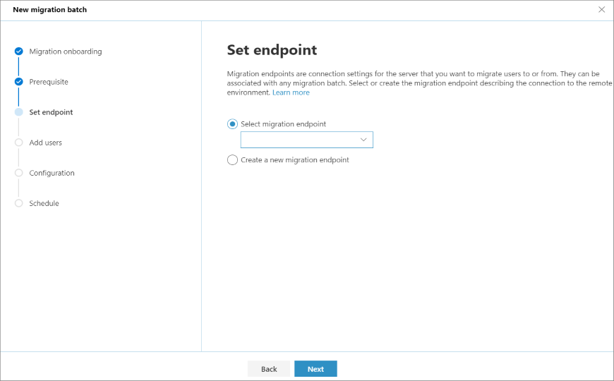

# Perform an automated Google Workspace migration to Microsoft 365 or Office 365 in the new EAC

With the new Exchange Admin Center (EAC), the migration of mails, contacts, and calendar from Google Workspace to Microsoft 365 or Office 365 has been automated. The process has been now simplified to the extent that several of the manual steps that a user had to perform manually are no longer required.

> [!NOTE]
> The new EAC continues to offer manual migration of Google Workspace to Microsoft 365 or Office 365.

## Start an automated Google Workspace migration batch in the new EAC

> [!IMPORTANT]
> Microsoft's data migration tool is currently unaware of tools enforcing messaging records management (MRM) or archival policies. Because of this, any messages that are deleted or moved to archive by these policies will result in the migration process flagging these items as "missing". The result is perceived data loss rather than actual data loss, which makes it much harder to identify actual data loss during any content verification checks.
>
> Therefore, Microsoft strongly recommends disabling all MRM and archival policies before attempting any data migration to mailboxes.

1. In the new Exchange Admin center at <https://admin.exchange.microsoft.com/#/>, go to **Migration** and then click **Add migration batch**.

2. The migration batch wizard opens. On the first page, configure the following settings:
   - **Give migration batch a unique name**: Enter a unique name.
   - **Select the mailbox migration path**: Verify that **Migration to Exchange Online** is selected.

   When you're finished, click **Next**.

3. On the **Select the migration type** page, select **Google Workspace (Gmail) migration**, and then click **Next**

   :::image type="content" source="../media/migration-onboarding-selection_new.png" alt-text="Select Migration Type.":::

4. On the **Prerequisites for Google Workspace migration** page, verify that the **Automate the configuration of your Google Workspace for migration** section is expanded, and then click **Start** in that section to automate the four required prerequisite steps.

5. In the Google sign in page that appears, sign in to your Google account to validate your APIs. Once the APIs are successfully validated, the following things happen:
   - A JSON file (projectid-*.json) is downloaded to your local system.
   - The link to add the ClientID and the Scope is provided. The ClientID and Scope are also listed for your reference.
   - Click the API access link. You will be redirected to Google Admin API Controls page.
   - Click **Add new**. Copy the ClientID and Scope from the EAC, paste it here, and then click **Authorize**.

6. On the **Set a migration endpoint** page of the wizard, select one of the following options:
   - **Select the migration endpoint**: Select the existing migration endpoint from the drop down list.
   - **Create a new migration endpoint**: Select this option if you're a first-time user.

   

   > [!NOTE]
   > To migrate Gmail mailboxes successfully, Microsoft 365 or Office 365 needs to connect and communicate with Gmail. To do this, Microsoft 365 or Office 365 uses a migration endpoint. Migration endpoint is a technical term that describes the settings that are used to create the connection so you can migrate the mailboxes.

   If you selected **Create a new migration endpoint**, do the following steps:

   1. On the **General Information** page, configure the following settings:
      - **Migration Endpoint Name**: Enter a value.
      - **Maximum concurrent migrations**: Leave the default value 20 or change the value as required.
      - **Maximum concurrent incremental syncs**: Leave the default value 10 or change the value as required.

      When you're finished, click **Next**.

   2. On the **Gmail migration configuration** page, configure the following settings:
      - **Email address**: Enter the email address that you use to sign in to the Google Workspace.
      - JSON key: Click **Import JSON**. In the dialog that appears, find and select the downloaded JSON file, and then click **Open**.

      Once the endpoint is successfully created, it will be listed under **Select migration endpoint** drop-down.

      Select the endpoint from the drop-down list, and click **Next**.


7. On the **Add user mailboxes** page, click **Import CSV file** and navigate to the folder where you have saved the CSV file.

   If you haven't already, create a CSV file containing the set of all of the users you want to migrate. You will need its filename below. The allowed headers are:

   - **EmailAddress** (required): Contains the primary email address for an existing Microsoft 365 or Office 365 mailbox.
   - **Username** (optional). Contains the Gmail primary email address, if it differs from EmailAddress.

   ```CSV
   EmailAddress
   will@fabrikaminc.net
   user123@fabrikaminc.net
   ```

   When you're finished, click **Next**.

8. On the **Move configuration** page, enter the details and then click **Next**.

9. On the **Schedule batch migration** page, verify all the details, click **Save**, and then click **Done**.

    

    Once the batch status changes from **Syncing** to **Synced**, you need to complete the batch.

To learn more, see the following topics:

- Completion of migration batch: See [Completion of migration batch in new EAC](completion-gspace-migration-batch-neweac.md).
- How the migration happens on the backend: See [Overview of the process](how-it-all-works-in-the-backend.md).
