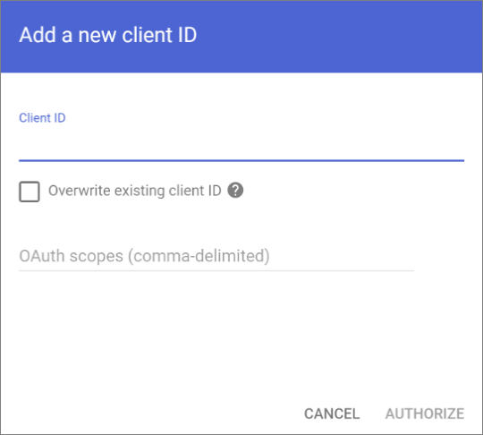

# Manually configuring G-Suite for migration

Following procedures are to be performed, if you are attempting manual migration of Google Workspace with either Classic or New EAC:

1. [Create a Google Service Account](#create-a-google-service-account)
2. [Enable API usage in your project](#enable-api-usage-in-your-project)
3. [Grant access to the service account for your Google Tenant](#grant-access-to-the-service-account-for-your-google-tenant)

## Create a Google Service Account

1. Using a Chrome browser, sign into your Google Workspace admin console at [admin.google.com](https://admin.google.com).
2. In a new tab or window, navigate to the [Service Accounts](https://console.developers.google.com/iam-admin/serviceaccounts) page.
3. Select **Create project**, name the project and choose **Create**.
4. Select **+ Create service account**, enter a name, choose **Create** and then **Done**.
5. Open the **Actions** menu, select **Edit**, and take note of the Unique ID. You'll need this ID later in the process.
6. Open the **Show domain-wide delegation** section.
7. Select **Enable G Suite Domain-wide Delegation**, enter a product name for the consent screen, and choose **Save**.

   > [!NOTE]
   > The product name is not used by the migration process, but is needed to save in the dialog.

8. Open the **Actions** menu again and select **Create key**.
9. Choose **JSON**, then **Create**.
   The private key is saved to the download folder on your device.
10. Select **Close**.

## Enable API usage in your project

If your project doesn't already have all of the required APIs enabled, you must enable them.

1. Go to the [Developer page for API Library](https://console.developers.google.com/apis/library) and sign in as the Google user you used above in **Create a Google Service Account**.

2. Select the project that you used above.

3. Search for the following APIs; each one must be enabled. Select **Enable** to enable them for your project:

   - Gmail API
   - Google Calendar API
   - Contacts API
   - People API

## Grant access to the service account for your Google tenant

1. Go to the [Google Workspace Admin page](https://admin.google.com/AdminHome) and sign in as Google Workspace admin for your tenant.

2. Click **Security**, then click **API Controls**, and then click **Manage Domain Wide Delegation**.

3. Next to the **API Clients** list, click **Add new**.

4. In **Client ID**, type the ClientId for the service account you created in the [Create a Google Service Account](#create-a-google-service-account) section above.

   

5. In **OAuth Scopes**, add the required scopes in comma-separated format, with no spaces in between. For example:

   `https://mail.google.com/,https://www.googleapis.com/auth/calendar,https://www.google.com/m8/feeds/,https://www.googleapis.com/auth/gmail.settings.sharing,https://www.googleapis.com/auth/contacts`

    If the OAuth Scopes are entered incorrectly, the resulting list won't match and the migration process will fail later, after you start the migration batch.

6. Click **Authorize**. Verify that the resulting list shows the expected four (4) OAuth scopes.

   > [!IMPORTANT]
   > It may take anywhere from 15 minutes to 24 hours for these settings to propagate.
