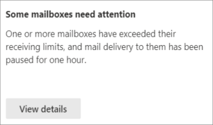
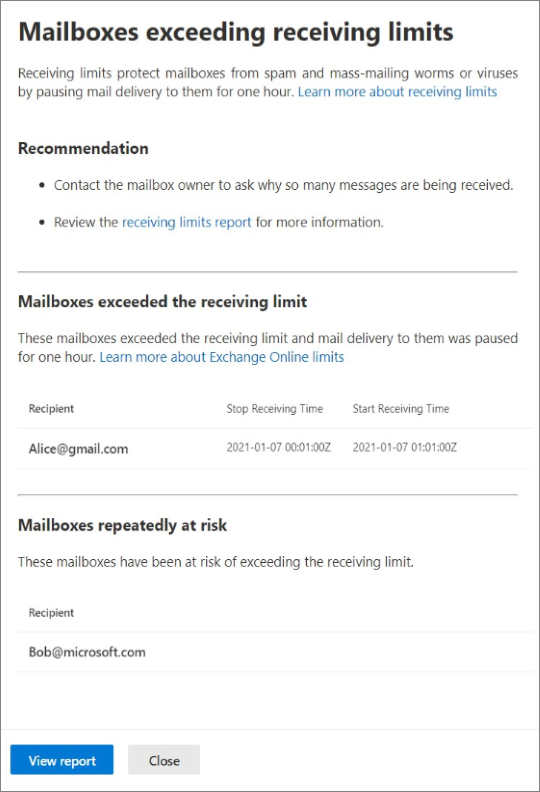

# Mailboxes exceeding receiving limits insight in the new EAC

Mailboxes that receive large volumes of messages in a short amount of time can lead to mail flow delays for those mailboxes, and mailboxes in your organization. 
The mailboxes exceeding receiving limits insight in the Insights dashboard in the new Exchange Admin Center (new EAC) highlights:

1. Mailboxes that have exceeded their receiving limit (For more information, see [Exchange Online limits](/office365/servicedescriptions/exchange-online-service-description/exchange-online-limits#receiving-and-sending-limits)), which means they can no longer receive mail until the limit is reset (which is 1 hour after the threshold is exceeded).

   - Mailboxes won't receive any mail at all if the overall receiving limit is exceeded
   
   - Mailboxes won't receive any mail from a specific sender, if the mailbox has received too many messages from the sender
   
2. Mailboxes that are at risk. They haven’t exceeded their limit but are receiving large volumes of messages regularly. 

The insight will only appear if:

1. Mailboxes have exceeded their receiving limit in the past 24 hours 

2. A mailbox has become newly warm in the past 24 hours

3. A mailbox has been warm for >12 hours of the past 24 hours

The insight will appear in the dashboard: 

 

When you click on **View details**, the following flyout will appear:

 

1. Select **Learn more about receiving limits** to view documentation about Exchange’s limits. 

2. Select **receiving limits report** to view a detailed report that shows up to seven days of data. Each section shows at least 20 mailboxes – if there are more, you may view them in the report. 

3. Mailboxes that appear in the **Mailboxes exceeded the receiving limit** section are mailboxes that have exceeded their receiving limit in the past 24 hours (includes overall receiving limit, and single sender sending too much email).

4. Mailboxes that appear in the **Mailboxes at risk now** section are mailboxes that have newly started receiving large volumes of mail. 

5. Mailboxes that appear in the **Mailboxes repeatedly at risk** section are mailboxes that have received large volumes of mail for > 12 hours of the past 24 hours.  

6. Select the email address of the mailbox to view the contact information of the owner of the mailbox. Contact the mailbox owner to understand why their receiving so much email, so they can reduce their mail volume and have a better experience.
