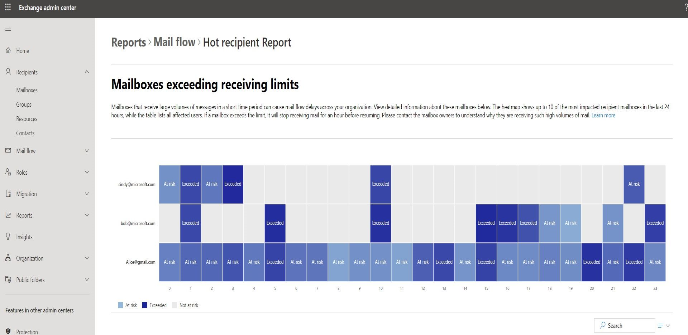

# Mailboxes exceeding receiving limits report in the new EAC

In the new Exchange Center (EAC), the Mailboxes exceeding receiving limits report displays information on mailboxes that are receiving large volumes of messages in a short amount of time.

> [!NOTE]
> For permissions that are required to use this report, see [Permissions required to view mail flow reports](mail-flow-reports.md#permissions-required-to-view-mail-flow-reports).

There are two sections to this report:

1. A heatmap that indicates:

    - When a mailbox exceeded their receiving limit (see [Exchange Online limits](/office365/servicedescriptions/exchange-online-service-description/exchange-online-limits#receiving-and-sending-limits)), which means they can no longer receive mail until the limit is reset (that is 1 hour after the threshold is exceeded).

      1. Mailboxes won't receive any mail at all if the overall receiving limit is exceeded.

      2. Mailboxes won't receive any mail from a specific sender, if the mailbox has received too many messages from the sender.

    - When a mailbox is at risk, which means they haven't exceeded their limit but are receiving large volumes of messages regularly.

2. A table that shows, in the selected time window:

   - The number of hours a mailbox has exceeded the limit

   - The number of hours a mailbox is at risk

   - The maximum number of messages they received per hour

   - The top sender

Changing the filters or searching for a mailbox will change both the heatmap and table.

> [!NOTE]
> The default view is for the last 24 hours for all types. If no data is showing, that means you had no mailboxes exceeding the limit (or at risk) in the last 24 hours.
>
> The chart is limited to showing the top 10 mailboxes. If you'd like to see more mailboxes, you'll have to filter/search differently.

1. Click **Export** to download the data as a csv.
2. Click **Share** to share the details with others.

3. Select a mailbox address to view in detail the mailbox owner's contact information. Contact the mailbox owner to understand why their receiving so much email, so they can reduce their mail volume and have a better experience.
