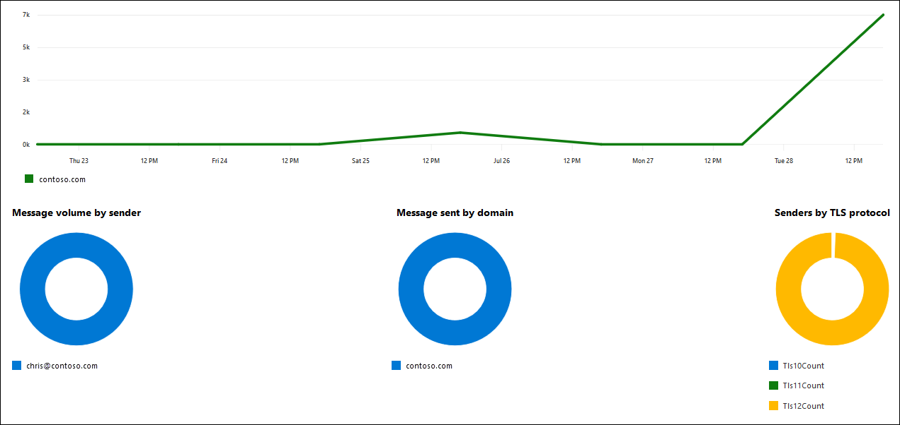

# SMTP AUTH clients report in the modern Exchange admin center

The **SMTP AUTH clients** report in the modern Exchange admin center (modern EAC) highlights the use of the SMTP AUTH client submission protocol by users or system accounts in your organization. This legacy protocol (which uses the endpoint smtp.office365.com) only offers Basic authentication, and is susceptible to being used by compromised accounts to send email. This report allows you to check for unusual activity. It also shows the TLS usage data for clients or devices using SMTP AUTH.

> [!NOTE]
> By default, the report shows data for the last 7 days. If the report is empty, try changing the date range.

The overview section contains the following charts:

- The volume of messages per day for each sending domain.
- **Message volume by sender**\*
- **Message sent by domain**\*
- **Senders by TLS protocol**\*

\* If you hover over a specific color in the chart, you'll see the number of messages.

The **Messages sent using SMTP Auth** section shows the following information:

- **Sender address**
- **Domain**
- **TLS 1.0** (percentage)
- **TLS 1.1** (percentage)
- **TLS 1.2** (percentage)
- **Messages sent**

To quickly filter the results, click **Search**  and start typing a value.

To filter the results by a date range, use the box. You can specify a date range up to 90 days.

For more advanced filters that you can also save and use later, click **Filter**  and select **New filter**. In the **Custom filter** flyout that appears, enter the following information:

- **Name your filter**: Enter a unique name.

- Click **Add new clause**. A clause contains the following elements that you need to enter:

  - **Field**: Select **Sender address**, **Domain**, **TLS 1.0**, **TLS 1.1**, **TLS 1.2**, or **Messages sent**.

  - **Operator**: Select **starts with** or **is**.

  - **Value**: Enter the value you want to search for.

  You can click **Add new clause** as many times as you need. Multiple clauses use AND logic (\<Clause1\> AND \<Clause2\>...).

  To remove a clause, click **Remove** 

  When you're finished, click **Save**. The new filter is automatically loaded, and the results are changed based on the filter. This is the same result as clicking **Filter** and selecting the customer filter from the list.

  To unload a existing filter (return to the default list), click **Filter**  and select **Clear all filters**.

Click **Export** to export the displayed results to a .csv file.

If you select a row, a details pane for the sender appears that contains the same information from the main report.
