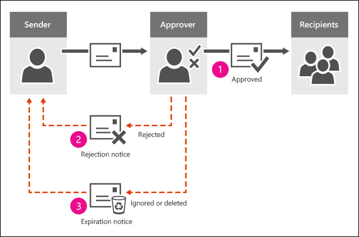

# Moderated recipients in Exchange Online

Sometimes it makes sense to have a second set of eyes on a message before the message is delivered. As an Exchange Online admin, you can set this up. Requiring approval before a message is deliver is called _moderation_, and the approver of the message is called the _moderator_.

There are two basic ways to do moderated mail flow in Exchange Online:

- **Require the approval of a moderator for messages sent to a specific recipient**: You can configure groups for moderation in the Exchange admin center (EAC). For other recipient types, you need to use Exchange Online PowerShell. For instructions, see [Configure moderated recipients in Exchange Online](configure-moderated-recipients-exo.md)

- **Require approval for messages that match specific criteria**: You use mail flow rules (also known as transport rule) to specify the message criteria (for example, message content, the message sender, or message recipients) and who needs to approve the message for delivery (which might include multiple levels of approval). For instruction, see [Use mail flow rules for message approval scenarios in Exchange Online](../../security-and-compliance/mail-flow-rules/common-message-approval-scenarios.md).

The rest of this article describes how moderation works in Exchange Online.

## How the message approval process works

When you send a message to a moderated recipient in Outlook on the web (formerly known as Outlook Web App), you're notified that your message might be delayed as shown in the following screenshot:

The moderator receives an email notification to approve or reject the delivery of the message. The text of the notification includes buttons to approve or reject the message, and the attachment includes the original message to review.

A message that's waiting for approval is temporarily stored in a system mailbox called the _arbitration mailbox_. The original message is kept in the arbitration mailbox until a moderator takes action on the message. The moderator can take one of the following actions:

- **Approve**: The message goes to the original intended recipients. The original sender isn't notified.
- **Reject**: A rejection message is sent to the sender. The moderator can add an explanation as shown in the following screenshot:

  

- **Ignore or delete the approval message** An expiration message is sent to the sender. In Exchange Online, the approval request expires after two days.

The message flow and result of a moderator's actions are described in the following diagram:

## Moderated recipient FAQ

### Q: What's the difference between a group moderator and a group owner?

A: The owner of a distribution group is responsible for managing the membership of the group. For example, an IT admin might be the owner of the All Employees distribution group, but the Human Resources manager might be set up as the moderator who's responsible for approving messages that are sent to the group.

Also, messages that the owner sends to the distribution group do not need to be approved by a moderator.

### Q: What happens when the moderator sends a message to the distribution group?

A: The message goes directly to the group, bypassing the approval process.

### Q: What happens when only a subset of recipients need approval?

A: Consider a message that's sent to 12 recipients, one of which is a moderated distribution group. The message is automatically split into two copies. One message is delivered immediately to the 11 recipients that don't require approval, and the second message is submitted to the approval process for the moderated distribution group.

If a message is intended for more than one moderated recipient, a separate copy of the message is automatically created for each moderated recipient and each copy goes through the appropriate approval process.

### Q: What if a distribution group contains moderated recipients that require approval?

A: A distribution group can include moderated recipients that also require approval. In this case, after the message to the distribution group is approved, a separate approval process occurs for each moderated recipient that's a member of the distribution group. However, you can also enable the automatic approval of the distribution group members after the message to the moderated distribution group is approved. To do this, you use the _BypassNestedModerationEnabled_ parameter on the [Set-DistributionGroup](/powershell/module/exchange/set-distributiongroup) cmdlet.

### Q: Is this process different if we have our own Exchange servers?

A: By default, one arbitration mailbox is used for each on-premises Exchange organization. If you have your own Exchange servers and need more arbitration mailboxes for load balancing, follow the instructions for adding arbitration mailboxes in [Manage and troubleshoot message approval](ttroubleshoot-message-approval.md). Arbitration mailboxes are system mailboxes and don't require an Exchange license.
