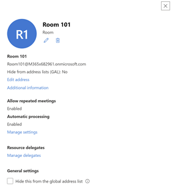
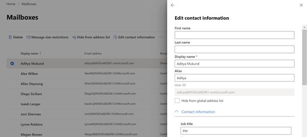
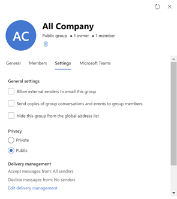
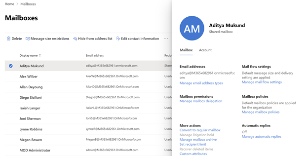
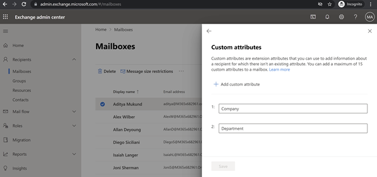
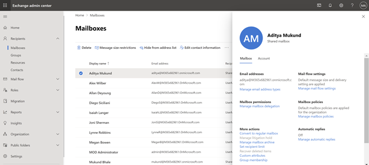
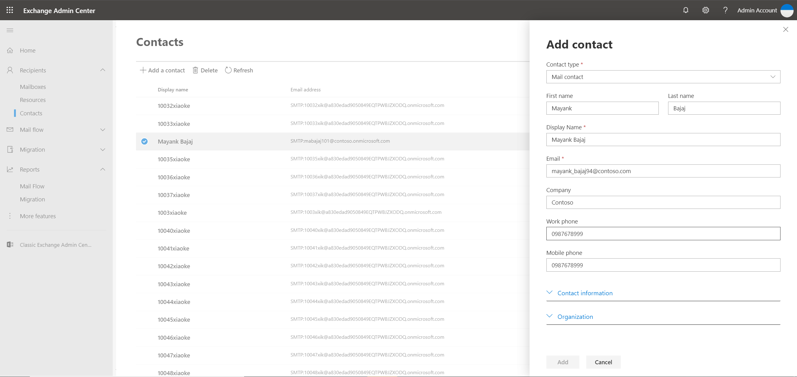
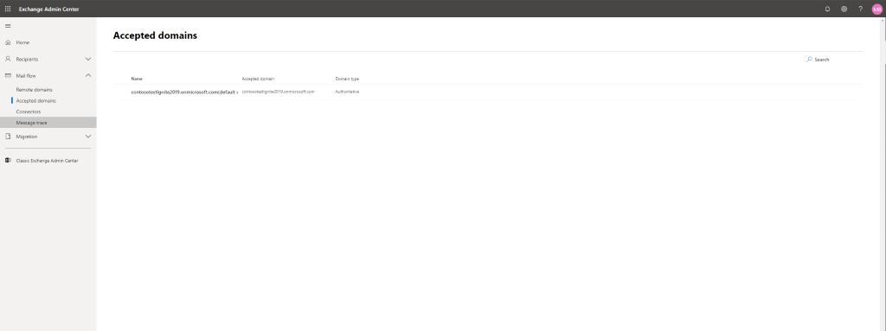

# What's new in the Exchange admin center in Exchange Online

We're continuously adding new features to the Exchange admin center (EAC); fixing issues as we learn about them and making changes based on your feedback. On this page, you can find highlights of all the recent changes we've made. Some features get rolled out at different times to our customers, so if you are not seeing a new feature yet, keep checking back.

The Exchange admin center now uses a new portal at <https://admin.exchange.microsoft.com>. The new EAC is a modern, web-based management console for managing Exchange, designed to provide an experience that is more aligned with the overall Microsoft 365 admin experience.

For now, it is possible to switch back to the existing EAC (often called the "classic" EAC).  However, the classic EAC will be fully deprecated by September 2022.

## September 2021

Here are some of the changes and new features we introduced in the modern EAC in September 2021.

**New EAC is now Generally Available in GCC-H**

The new Exchange admin center (EAC) is a modern, accessible, web-based management portal for managing Exchange Online based on the Microsoft 365 admin center experience. The new EAC was made generally available to our worldwide (WW) users in April 2021 and our GCC customers in June 2021. Today, we are excited to announce that the new EAC is now generally available for our GCC-H customers. The EAC URL for GCC-H customers is https://admin.exchange.office365.us

**Announcement of ECP Deprecation**
With the new EAC providing the majority of admin capabilities, we are now at the next stage of our journey, and we have announced the retirement of the classic EAC in our WW deployment. The new EAC will be fully deprecated by **September 2022**.

>[!Important
> This change is for Worldwide (WW) only. It does not affect GCC, GCC-High, DoD, or other Sovereign Clouds.

The Classic EAC deprecation timeline is planned as follows:

You can read more about the Classic EAC deprecation here: Deprecation of the classic Exchange admin center in WW service - Microsoft Tech Community

## August 2021

Here are some of the changes and new features we introduced in the modern EAC in August 2021.

**Customizable Settings: Normal/Compact list view**

In our efforts to provide customizable settings to admins, the new EAC has introduced a feature, 'Settings', located in the left navigation panel.

Currently, it has one customizable setting for admins; 'List view preference'. This setting allows users to select the normal view or compact view as the preferred list view for the entire EAC portal. Once the user selects either of the views, it is applied to all the list pages in the new EAC.

**Hide from GAL feature in resources**

The Hide from GAL [Global Address List] feature in resources is now available. Click on any of the resource mailboxes, and this feature setting can be found under General settings.

## July 2021
Here are some of the changes and new features we introduced in the modern EAC in July 2021.

**Dynamic distribution list [DDL] created through PowerShell can now be seen in new EAC**

The admins could always create a Dynamic distribution list/group from PowerShell. If the user creates a DDL with different recipient filters, this PowerShell-created DDL can now be viewed in new EAC by admins.

Reflection of the created DDL in new EAC:

The recipient filter setting is non-editable from the new EAC. The admin will have to use PowerShell to edit the member setting.

**Hide from GAL feature in mailbox & groups**

Hide from GAL [Global Address List] was a long-awaited feature and is now live for use.
User and Shared Mailboxes: Click on any user/shared mailbox for which you want to check the 'Hide from GAL' setting, click on 'Account' and then click on 'Manage contact information' to edit the setting.
 

 
Groups: Hide from GAL functionality is also now available in all 4 types of Groups [Microsoft 365 group, Distribution list, Mail-enabled security group and Dynamic distribution list]. The setting is available under Settings tab of the groups.

## June 2021

Here are some of the changes and new features we introduced in the modern EAC in June 2021.

**New EAC is now Generally Available in GCC**

The new Exchange admin center (EAC) https://admin.exchange.microsoft.com is a modern, accessible, web-based management portal for managing Exchange Online based on the Microsoft 365 admin center experience. The new EAC was made generally available to our WW users in April 2021. Today, we are excited to announce that the new EAC is generally available for our GCC customers.
The GCC customers now have access to a new dashboard, new usability features, and several intelligent reports to help them be more productive in their work.

**UX Enhancement in new EAC: Coherence with Microsoft 365 admin center**

To provide a more coherent experience, the new EAC team made efforts to enhance the UX to become close to the Microsoft 365 admin center experience. The command bars and the detail panels now have similar control and navigation experiences in both the portals.

## May 2021
Here are some of the changes and new features we introduced in the modern EAC in May 2021.

**Custom Attributes in Mailboxes**

The new EAC now includes 15 extension attributes that you can use to add information about a recipient, such as an employee ID, organizational unit (OU), or some other custom value for which there isn't an existing attribute. You can use the EAC to manage the attributes, and you don't need to build custom controls or write scripts to populate and display these attributes.

**Missing "Member of" attribute in mailboxes view**

New EAC now offers a view of the Groups that a particular mailbox is a part of.

**Easier role group creation for new tenants**

Our new customers were facing an issue while creating a new role group. The users ended up with a warning text that they would have to Enable-OrganizationCustomization at their end by using PowerShell. This issue has been fixed now, and all our users can create Role groups without any extra step.

## April 2021

**New EAC is now Generally Available in Worldwide (WW)**

The new Exchange admin center (EAC) [https://admin.exchange.microsoft.com] is a modern, accessible, web-based management portal for managing Exchange Online based on the Microsoft 365 admin center experience. Since entering Public Preview in June 2020, over half a million admins worldwide have used it.
Today, we are excited to announce that the new EAC is generally available for customers in 10 languages. With this announcement, we are also releasing a new dashboard, new usability features, and several intelligent reports to help admins be more productive in their work.

Here are some highlights:

- **Personalized Dashboard, Reports, Insights** – The New EAC offers actionable insights and includes mail flow, migration, and priority monitoring reports.
 
https://www.microsoft.com/en-us/videoplayer/embed/RWBuGX
 
- **Azure Cloud Shell** – Cloud Shell is a browser-accessible shell that provides a command-line experience built with Azure management tasks in mind. It enables admins to choose a shell experience that best suits their work style.
 
https://www.microsoft.com/en-us/videoplayer/embed/RWBuFn
You can read more about it here: Announcing General Availability of the new Exchange admin center - Microsoft Tech Community

## February 2021

Here are some of the changes and new features we introduced in the modern EAC in February 2021.

### Three more reasons to love the modern Exchange admin center (EAC)

Exchange admin center, the digital workspace for IT admins, is where work gets done. The new EAC portal (<https://admin.exchange.microsoft.com>) now brings together more features, such as Rules, Organization, and Public Folders. Also new to the modern EAC are the Another User feature (which has been a major Help desk admin demand) and support for flow for all of our delegated admins.

:::image type="content" source="media/exo-whatsnew-feb21-1.png" alt-text="Three new features in the modern EAC.":::

### One portal to meet all Exchange IT admin needs

Having access to the tools we need without context switching is essential. The power of new features we've introduced in the modern EAC is tremendous and exciting.

#### 1. Rules, Organization, and Public Folders

Rules, Organization, and Public Folders from the classic EAC are now available in the modern EAC. Admins can take actions on messages that flow through their Exchange Online organization through Rules. They can set up organization relationships to share calendar information with external business partners through Organization sharing. In addition, admins can collect, organize, and share information with other people in their workgroup or organization through Public Folders.

> [!NOTE]
> Permissions granted via [Azure Privileged Identity Management](/azure/active-directory/privileged-identity-management/) won't work for Rules, Organization, or Public Folders in the modern EAC.

#### 2. Another user

The new, modern EAC now has a **View another mailbox** option, which adjusts Inbox rules and out-of-office messages on behalf of a user, without requiring that user to grant full admin access to their mailboxes.

#### 3. Delegated admin support

A delegated admin now has access to the modern EAC portal. Currently, admins need to log in to <https://partner.microsoft.com>, where they will be directed to the classic EAC portal, and from there they can access the modern EAC.

## December 2020

Here are some of the changes and new features we introduced in the modern EAC in December 2020.

### Groups – creation and management

Admins can now create and manage four kinds of groups from the modern EAC: Microsoft 365 groups, distribution lists, mail-enabled security groups, and dynamic distribution lists. The groups experience has now reached parity with that of the classic EAC. The new group type that we recently introduced in the modern EAC is [dynamic distribution lists](#dynamic-distribution-lists).

The pivot experience (different pivots for different group types) makes groups management even easier.

:::image type="content" source="media/exo_whatsnew_dec20_1.png" alt-text="a dynamic distribution list in the modern EAC.":::

### Dynamic distribution lists

Dynamic distribution lists are mail-enabled Active Directory group objects, created to expedite the mass sending of email messages and other information within an Exchange organization.

The membership list for dynamic distribution groups is calculated each time a message is sent to the group, based on the filters and conditions that are defined.

:::image type="content" source="media/exo_whatsnew_dec20_2.png" alt-text="Assigning users in a dynamic distribution list in the modern EAC.":::

### Delivery management setting

This setting allows admins to manage who can send email to any group. The user can define these settings once the group is created. This setting is available in all group types.

:::image type="content" source="media/exo_whatsnew_dec20_3.png" alt-text="Delivery management setting in the modern EAC.":::

### Message approval setting

Admins can use this setting to configure whether or not messages sent to a particular group need to be approved by a moderator. This setting also allows admins to define who the group moderators are, and it allows admins to define any message senders who do not require message approval. This setting is available in distribution groups, dynamic distribution groups, and mail-enabled security groups.

### Membership approval setting in mail-enabled security groups

For mail-enabled security groups, there is now a check box called **owner approval is required**. After this check box is selected, the owner of the mail-enabled security group needs to manually add or remove group members from that group.

### Membership approval setting in distribution groups

Admins can now manage the membership approval settings during or after the creation of a distribution group. It allows admins to configure the moderation settings for who can join the group, and for who can remove members from a group.

:::image type="content" source="media/exo_whatsnew_dec20_4.png" alt-text="Membership approval setting in distribution groups.":::

## September 2020

Here are some of the changes and new features we introduced in the modern EAC in September 2020.

### Group creation and management

Admins can now create groups from the modern EAC. Currently, they can create and manage M365 groups, distribution groups, and mail-enabled security groups.

:::image type="content" source="media/exo_whatsnew_sept20_1.png" alt-text="Choose a group type dialog.":::

The three types of groups that M365 administrators can now create and manage are:

- **M365 groups** – These are the recommended group type, and they allow for effective collaboration by providing group members a shared email and a shared workplace.
- **Distribution groups** – These are the most commonly used group type, and they allow you to send email to all members of the distribution list.
- **Mail-enabled security groups** – These groups give members access to various resources like OneDrive, SharePoint, and various admin roles.

### Normal/Compact list views in groups

Administrators can now choose to view the list of groups in their organization in either normal or compact list view. The compact list option allows administrators to view more entries on a single page.

### Naming policy for groups

Administrators now have command over the group naming policy. They can now add prefixes and suffixes for future groups that will be created, and they can block specific words from being used in group names and aliases.

### Upgrade distribution groups

Administrators can now upgrade their distribution groups into the recommended Microsoft 365 groups (previously Office 365 groups) with a few clicks, as shown below:

:::image type="content" source="media/exo_whatsnew_sept20_2.png" alt-text="Ready to upgrade dialog.":::

### Opt-in/out

End-users now have a single-click opt-in toggle button, available in both the classic Exchange admin center and in the new EAC. This button provides easy navigation between the two portals, allowing users to switch to and explore the new portal seamlessly.

### Support Assistant

The admins can now get their queries resolved without going anywhere else. The support assistant feature allows users to resolve the queries without leaving the EAC window. In case the user is not satisfied with the provided solution, the user can even raise a ticket and register their issues.

:::image type="content" source="media/exo_whatsnew_sept20_3.png" alt-text="Support Assistant in the new EAC.":::

### Educational navigation video

An educational video is now available on the very first tile, **Training and Guide**, in the new EAC portal. The video walks users through the basic navigation of the new portal. You can also access the video [here](https://www.microsoft.com/videoplayer/embed/RE4FqDa).

### Recipients – documentation updated

As part of Microsoft's efforts to help users familiarize themselves with the new Exchange admin center (EAC) portal, the Exchange Online documentation has been updated for the highest-trafficked articles under [**Recipients**](./recipients-in-exchange-online/recipients-in-exchange-online.md).

## July 2020

Here are some of the changes and new features we introduced in the modern EAC in July 2020.

### Mail flow Reports

Exchange admins can now use the existing dashboard to choose from new variety of mail flow cards that personalize their experience for ease of use and better productivity. To access this dashboard, go to the Exchange admin center and select Add Card (+) to see the new cards.

Discover and understand some more trends related to mail flow in your Microsoft 365 or Office 365 organization. The following report were already available in the Security & Compliance Center but are now available in the EAC for added convenience.

Top domain mail-flow status report: To identify and troubleshoot domains with mail flow issues. [Learn more](/microsoft-365/security/office-365-security/mfi-domain-mail-flow-status-insight).

Queued messages report: To check those messages that are queued for more than 1 hour and were sent through connectors from your Microsoft cloud org. [Learn more](/microsoft-365/security/office-365-security/mfi-queue-alerts-and-queues).

SMTP AUTH clients report: To check for unusual activity and TLS used by clients or devices using SMTP AUTH. SMTP AUTH client submission protocol only offers basic authentication and is a less-secure protocol used by devices, such as printers, to send email messages. [Learn more](/microsoft-365/security/office-365-security/mfi-smtp-auth-clients-report).

:::image type="content" source="media/whats-new-2020-07-mail-flow-reports.png" alt-text="Screen capture of mail flow reports.":::

## June 2020

Here are some of the changes and new features we introduced in the modern EAC in June 2020.

### Manager and directs

Microsoft 365 administrators can now add **Manager** and **Direct reports** for individual mailboxes. Admins can manage this organizational information in the **Accounts** tab in the **Detail** panel.

:::image type="content" source="media/whats-new-2020-06-1-directs.png" alt-text="Screen capture of manager and direct reports.":::

### Custom attributes

Admins can include fifteen extension attributes that they can use to add information about a recipient, such as an employee ID, organizational unit (OU), or some other custom value for which there isn't an existing attribute.

:::image type="content" source="media/whats-new-2020-06-2-customatt.png" alt-text="Screen capture of custom attributes.":::

### Google Workspace (formerly G Suite) automation

Admins can migrate batches of users from Google Workspace to Microsoft 365. In order to move the mailboxes from Google Workspace to Microsoft 365, there is a series of steps that admins need to perform in Google Workspace in order to establish the connection between the two environments. The new EAC aims to help the admins automate those steps to make the process easier and more convenient.

:::image type="content" source="media/whats-new-2020-06-3-gsuite.png" alt-text="Screen capture of G-suite automation.":::

## May 2020

Here are some of the changes and new features we introduced in the modern EAC in May 2020.

### Delete shared mailbox

In the modern EAC, Microsoft 365 administrators can now delete an already existing shared mailbox. Admins can also select multiple shared mailboxes and choose the **Delete** button in the command bar to bulk delete them.

:::image type="content" source="media/whats-new-2020-05-1-delete-shared.png" alt-text="Screen capture of deleting shared mailboxes.":::

### Set default message size restriction

Message size limits control the size of messages that a user can send and receive. By default, when a mailbox is created, there isn't a size limit for sent and received messages. However, admins can use this control to set a default limit. This limit will be applied to any new mailboxes created in the Exchange environment.

:::image type="content" source="media/whats-new-2020-05-2-msgsize-restriction.png" alt-text="Screen shot of setting message size restrictions.":::

### Export to .csv

Admins can now click on the **Export** button in the command bar to prepare a .csv file lists all of the mailboxes residing in Exchange Online.

:::image type="content" source="media/whats-new-2020-05-3-export-csv.png" alt-text="Screen capture of exporting a csv file.":::

## April 2020

Here are some of the changes and new features we introduced in the modern EAC in April 2020.

### Contacts

Admins now have a new experience when managing contacts for people outside the organization. Admins can create and manage mail contacts and mail users with external email addresses.

### Column chooser

Admins can now customize the columns that appear in the EAC.

### People picker for remote migration

A very common request from our customers was to bring back the people picker for a remote migration scenario. This helps admins to move the selected mailboxes to Exchange Online.

### Personalized Dashboard and Reports

Exchange admins can now use a dashboard to choose from a wide variety of cards that personalize their experience for ease of use and better productivity. To access the dashboard, go to the Exchange admin center and select **Add Card (+)** to see the new cards:

- **Migration report**: Learn about the status of the migration batches in your Exchange environment.
- **Mail flow reports**: Discover and understand trends related to mail flow in your Microsoft 365 or Office 365 organization. These reports were already available in the Security & Compliance Center, but are now available in the EAC for added convenience.
  - **Auto-forwarded messages**: Monitor for potential data leaks when people in your organization automatically forward email messages to an external domain, such as a personal email address. [Learn more](/microsoft-365/security/office-365-security/mfi-auto-forwarded-messages-report).
  - **Inbound & outbound messages details**: Monitor message volume and TLS encryption for each connector. [Learn more](/microsoft-365/security/office-365-security/mfi-outbound-and-inbound-mail-flow).
  - **Non-accepted domain**: Display messages from your on-premises organization where the sender's email domain isn't configured as an accepted domain in Microsoft 365 or Office 365. [Learn more](/microsoft-365/security/office-365-security/mfi-non-accepted-domain-report).
  - **Non-delivery report**: Display the most commonly encountered error codes in non-delivery reports (also known as NDRs or bounce messages) for your message senders. [Learn more](/microsoft-365/security/office-365-security/mfi-non-delivery-report).

### Recoverable Items

Admins now have a new experience for finding recoverable items. With this feature, items that were deleted from a user's mailbox can be recovered back to the inbox.

## March 2020

Here are some of the changes and new features we introduced in the modern EAC in March 2020.

#### Recipients

In the modern EAC, the user and shared mailbox management experiences are now merged, and the mailbox list and properties are available on the same page. The option to filter mailboxes based on type can be found on the top right.

Resources experience has been simplified for managing room and resource mailboxes.

#### Migration

Migration is now a first-class citizen under the Modern EAC and is no longer buried inside the Recipient tab as it was in the classic EAC. The major feature additions to the migration flow are:

- The Exchange and Google Workspace migrations are now simple, wizard-based experiences.
- The Google Workspace migration supports migrating Calendar and Contact data along with emails.
- For Google Workspace migration, the 2GB per mailbox per day restriction has been removed.

#### Mail flow

The Mail flow Experience, which was a part of the Security and compliance portal, is now returning to EAC. As a part of the experience, we have added the following features:

- Accepted domains
- Remote domains
- Connectors

#### Want to access more features?

As the modern experience is being developed, we are providing deep links from the new portal for users to move to the old portal for completing their work.

To access familiar features that were in the classic Exchange admin center, click on the "More features" tab on the left nav and select the feature to open it in a new tab.

## What's next?

We are working hard to create modern experiences for Exchange admins. Here are some features that are coming soon:

- Parity Experience with the classic EAC
  - Groups
  - Permissions
  - Organization
  - Public Folders
- New Value additions for customers
  - Cloud shell
  - Tenant switcher
  - Search

Check out our [Ignite blog entry](https://techcommunity.microsoft.com/t5/exchange-team-blog/exchange-admin-improvements-announced-at-microsoft-ignite-2019/ba-p/982121) where we detail the changes to the Exchange admin center, as well as other Exchange Online improvements that we announced at Microsoft Ignite 2019.

## Feedback and wishlist

Our goal is to deliver the features that IT admins need, so please share your feedback and wishlist with us through the "Give Feedback" button on the new portal.
